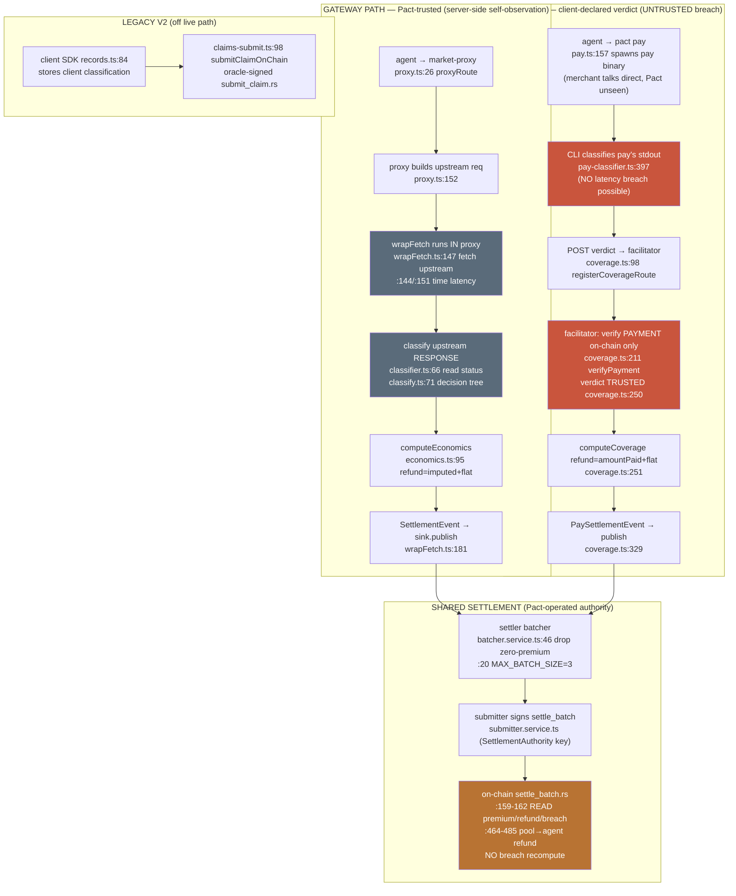

# MECHANISM_MAP — where Pact decides a breach today

> Authored 2026-06-11 on `master`. Companion: `VERDICT_SOURCE_DESIGN.md`.
> Every claim about current behavior cites `file:line` against the code on this
> branch. Where a path could not be confirmed it is marked **UNVERIFIED**.
> Existing convention note: the trust write-up lives at
> `docs/architecture/TRUST-MODEL.vi.md`; these two new docs are placed at repo
> root per the task brief (root-level UPPERCASE `.md` is an established
> convention here — `CHANGELOG.md`, `DEPLOY.md`). If you prefer them under
> `docs/architecture/`, move both together; nothing in them is path-dependent.

> **UPDATE — spike landed (branch `spike/verdict-source-10`).** This map
> describes the PRE-spike code. The spike on top of it: (1) stamps a
> `VerdictSource` (`pact_observed` / `client_attested` / `oracle`) on every
> settlement event; (2) **enforces the previously-documented-but-unapplied
> `imputedCost` refund cap** on the x402 path (red-team finding C-1 — the §2a
> "refund = amountPaid + premium" below was UNBOUNDED; it is now
> `min(amountPaid, imputed) + premium`); (3) adds a feature-flagged
> accept-and-monitor abuse gate, default off. See `RECOMMENDATION.md` for the
> decisions and the residual moral-hazard verdict.

## TL;DR

The breach verdict is computed **off-chain**, in exactly one of three places
depending on which entrypoint the agent used. The on-chain program is a dumb
executor — it transfers whatever `refund_lamports` the settler hands it and does
**not** recompute or verify the breach.

| Path | Where the verdict is computed | Trust label | Observes upstream itself? |
|---|---|---|---|
| Gateway proxy (`pact <url>` / market-proxy) | `@pact-network/wrap` running **inside the proxy server** | **Gateway/proxy-driven (Pact-trusted)** | **YES** — the proxy makes the upstream fetch and times it |
| x402 direct (`pact pay`) | CLI classifies on the **client**, facilitator accepts the `verdict` verbatim | **Client-driven (untrusted)** for the breach; payment is on-chain-verified | NO (for the breach) |
| Legacy scorecard claims (`/api/v1/claims/submit`, V2 Anchor) | client SDK supplies `classification`; backend stores it and submits it | **Client-driven (untrusted)** | NO |

The two on-chain programs that move money (`settle_batch` in V1 Pinocchio,
`submit_claim` in the legacy V2 Anchor crate) both take the verdict and amounts
as **trusted inputs** signed by a Pact-controlled authority/oracle key.

---

## 1. WHERE the SLA / breach verdict is computed today

### 1a. Gateway/proxy path — `@pact-network/wrap` (Pact-trusted, server-side)

The single shared decision tree is `@pact-network/classifier`:

- `packages/classifier/src/classify.ts:71` — `classifyHttpOutcome()`. Pure
  function. First-match decision tree (`classify.ts:74-86`):
  - no response (`networkError` OR `statusCode == null/0`) → `network_error`
  - `500..599` → `server_error`
  - `400..499` (incl. 429) → `client_error`
  - `200..299` AND `latencyMs > latencyThresholdMs` → `slow`
  - `200..299` within threshold → `success`
  - everything else (1xx, 3xx, ≥600) → `other`

`wrap` maps that neutral category to its own vocabulary + money:

- `packages/wrap/src/classifier.ts:62-107` — `defaultClassifier.classify()`.
  - reads the upstream status at `classifier.ts:66`
    (`statusCode: response === null ? null : response.status`)
  - `slow` → `latency_breach` (`classifier.ts:82-83`)
  - calls `computeEconomics()` (`classifier.ts:96`) to attach premium/refund.
- Breach rule, in words (from `classifier.ts:51-60` doc + `economics.ts`):
  - `5xx` / `network_error` / `latency_breach` → **covered breach**:
    `premium = flat`, `refund = principal + flat`.
  - `4xx` → `client_error`: `premium = 0`, `refund = 0` (uncovered).
  - `2xx ≤ SLA` → `ok`: `premium = flat`, `refund = 0`.
- The **latency threshold** is per-endpoint config `sla_latency_ms`, threaded in
  from the proxy: `market-proxy/src/routes/proxy.ts:161-166`
  (`sla_latency_ms: endpoint.slaLatencyMs`). The DB row column is `slaLatencyMs`.
- Refund/premium **MATH** is centralized in
  `packages/wrap/src/economics.ts:79-105` (`computeEconomics`). Covered-breach
  refund = `principal + flatPremiumLamports` (`economics.ts:95-96`). On the
  gateway path `amountPaid` is omitted, so `principal = imputedCostLamports`
  (`economics.ts:95`). This is the agent-tasks#11 "amountPaid + premium" rule.

**Per-endpoint plugin overrides (still server-side, still Pact-trusted):**
- `market-proxy/src/lib/classifiers.ts:52-86` — `buildHeliusClassifier`. Helius
  returns HTTP 200 with a JSON-RPC `error.code`. It hoists the SLA-latency check
  to any 2xx (`classifiers.ts:66-69`), then maps `-32603` / `-32000..-32099` →
  `server_error` + refund (`classifiers.ts:80-81`); other JSON-RPC errors →
  `client_error`, no premium (`classifiers.ts:84`). All other endpoints
  (birdeye, jupiter, elfa, fal, moralis, covalent, dummy) use the body-agnostic
  default (`classifiers.ts:97-108`).

### 1b. x402 direct path — client classifies, facilitator trusts the verdict (untrusted)

- `packages/cli/src/lib/pay-classifier.ts:397-509` — `classifyPayResult()` runs
  **on the agent's machine**. It scrapes `pay`'s stdout/stderr for an HTTP status
  (`pay-classifier.ts:446-448`, via the `[pact-http-status=NNN]` marker injected
  into curl at `pay-classifier.ts:152`) and maps `≥500 → server_error`
  (`pay-classifier.ts:461`), `≥400 → client_error` (`pay-classifier.ts:469`).
- **It cannot detect a latency breach at all** — `pay 0.16.0` does not emit a
  latency field, stated explicitly at `cli/src/lib/x402-receipt.ts:49-52` and
  `pay-classifier.ts:155-157`. So `latency_breach` is never produced here today.
- The CLI POSTs this `verdict` to the facilitator:
  `cli/src/cmd/pay.ts:273` → `registerCoverage(...)`.
- **The facilitator accepts the client's `verdict` verbatim.** In
  `packages/facilitator/src/routes/coverage.ts`:
  - it only checks the verdict is a *well-formed enum*:
    `coverage.ts:186` (`isKnownVerdict(body.verdict)`).
  - it maps verdict → outcome and computes money with **no breach re-check**:
    `coverage.ts:250-258` (`verdictToOutcome` then `computeCoverage`).
  - The facilitator DOES verify the **payment** on-chain when `payee` +
    `paymentSignature` are present (`coverage.ts:205-221`, calling
    `payment-verify.ts:68` `verifyPayment`) — but that proves *the agent paid the
    merchant*, **not** *the call failed*. In the common "unverified" mode
    (`pay 0.16.0` never logs payee/sig) even that payment check is skipped
    (`coverage.ts:222-224`, `verified=false`).
- This is the architecture's known weak spot, documented by the Pact team in
  `docs/architecture/TRUST-MODEL.vi.md:34-56` ("Đường yếu: facilitator (x402) —
  tin verdict do client khai" — *trusts the client-declared verdict*), tracked as
  agent-tasks#10.

### 1c. Legacy scorecard / V2 claims path — client-supplied classification (untrusted)

- The client SDK ingests pre-classified records:
  `packages/backend/src/routes/records.ts:84-88` validates only that
  `records[i].classification` is a *well-formed enum value* and stores it
  (`records.ts:153,163`). No recompute.
- A claim re-reads that stored `cr.classification`
  (`backend/src/routes/claims-submit.ts:54` SELECT, used at line 92) and submits
  it on-chain (`claims-submit.ts:98` → `submitClaimOnChain`).
- `backend/src/services/claim-settlement.ts:94` maps `classification` →
  `triggerType` and signs `submit_claim` with the **oracle** key
  (`claim-settlement.ts:117`). This is the **legacy V2 Anchor product**
  (`@q3labs/pact-insurance`), separate from the live V1 `settle_batch` rails.
- The `monitor` SDK also classifies client-side (`packages/monitor/src/classifier.ts:4-47`)
  but that feeds the **reliability scorecard only — no money** (corroborated by
  `TRUST-MODEL.vi.md:22`).

### 1d. NOT a verdict source (downstream projections — they never recompute)

- `packages/indexer/src/events/events.service.ts:384` calls `outcomeToBreach()` —
  a *pure projection* of the already-decided `outcome` into `breach`/`breachReason`
  columns (`indexer/src/events/events.dto.ts:100-120`). It trusts
  `premiumLamports`/`refundLamports` verbatim (`events.service.ts:394-395`).
- `packages/indexer/src/refund-delivery/refund-delivery.service.ts:146` likewise
  reuses `outcomeToBreach` for webhook fan-out only.

---

## 2. WHERE / HOW a refund is authorized today (verdict → claim → settle tx)

### 2a. Live V1 rails (gateway + x402 both land here)

1. **Verdict + event emit (off-chain).** Both money paths build the same
   `SettlementEvent` shape and publish to a shared Pub/Sub topic:
   - Gateway: `wrap/src/wrapFetch.ts:169-186` constructs the event (premium,
     refund, outcome, latency) and fire-and-forget `sink.publish(event)`
     (`wrapFetch.ts:181`). Sinks: `wrap/src/eventSink.ts` (Pub/Sub / Redis / HTTP).
   - x402: `facilitator/src/routes/coverage.ts:314-329` builds a
     `PaySettlementEvent` (superset, `source:"pay.sh"`) and
     `ctx.publisher.publish(event)` (`coverage.ts:329`,
     `facilitator/src/lib/events.ts:109-115`).
2. **Settler consumes + batches (off-chain, Pact-operated).**
   - `settler/src/batcher/batcher.service.ts:38-65` — `push()`. **Drops
     zero-premium events** at the boundary (`batcher.service.ts:46-53`) so
     `client_error` never reaches chain. Batches up to `MAX_BATCH_SIZE = 3`
     (`batcher.service.ts:20`), partitioned single-(network,slug)
     (`batcher.service.ts:79-94`).
   - `settler/src/pipeline/pipeline.service.ts:103-162` — `processBatch()` →
     `submitter.submit(batch)` (`pipeline.service.ts:109`).
3. **Settler signs `settle_batch` (off-chain → on-chain).**
   - `settler/src/submitter/submitter.service.ts` builds the tx via
     `buildSettleBatchIx` (imported `submitter.service.ts:52`) signed by the
     **SettlementAuthority signer keypair** (`submitter.service.ts:18-23` doc).
4. **On-chain executes the refund — does NOT recompute the verdict.**
   - `packages/program/programs-pinocchio/pact-network-v1-pinocchio/src/instructions/settle_batch.rs`.
   - It **reads** `premium_lamports`, `refund_lamports`, `breach` straight off
     the wire (`settle_batch.rs:159-162`).
   - Premium-in: agent ATA → pool vault (`settle_batch.rs:329-337`).
   - Fee fan-out: pool → recipient ATAs (`settle_batch.rs:435-452`).
   - **Refund (on breach): pool vault → agent ATA** (`settle_batch.rs:464-485`),
     amount = `intended_refund_after_cap` (the wire `refund_lamports`, clamped by
     the hourly exposure cap at `settle_batch.rs:408-423` and pool balance at
     `settle_batch.rs:470-477`).
   - On-chain guards (the ONLY protections): caller must equal
     `SettlementAuthority.signer` (`settle_batch.rs:134-135`), protocol/endpoint
     not paused (`settle_batch.rs:113-115`, `:217-219`), `premium ≥
     MIN_PREMIUM_LAMPORTS` (`settle_batch.rs:169-171`), duplicate `call_id`
     rejected (`settle_batch.rs:202-204`), hourly exposure cap + pool-balance
     clamp. **There is no SLA/status/latency re-derivation on-chain.**

**Does the on-chain refund pay `amountPaid + premium`? YES, by construction
off-chain.** The on-chain program transfers exactly the `refund_lamports` it is
handed. That number was computed off-chain by `computeEconomics`
(`wrap/src/economics.ts:90-97`) as `principal + flatPremium`:
- gateway: `principal = imputedCostLamports` (`economics.ts:95`, no `amountPaid`).
- x402: `principal = amountPaid` = the agent's claimed `amountBaseUnits`
  (`facilitator/src/lib/coverage.ts:118-131` → `computeEconomics(..., amountPaid)`;
  `coverage.ts:251-258`).
- The two numbers' provenance: `flatPremiumLamports` and `imputedCostLamports`
  come from the per-endpoint pool config (gateway:
  `proxy.ts:163-165` from the registry row; x402:
  `facilitator/src/lib/pool-config.ts` `readPoolConfig`, `coverage.ts:228`).

### 2b. Legacy V2 Anchor path (`submit_claim`)

- `backend/src/routes/claims-submit.ts:98` → `claim-settlement.ts:63`
  `submitClaimOnChain` builds `getSubmitClaimInstruction(...)`
  (`claim-settlement.ts:110-127`) signed by `client.oracleSigner`
  (`claim-settlement.ts:117`).
- On-chain instruction: `packages/program/programs/pact-insurance/src/instructions/submit_claim.rs`
  (Anchor crate, marked **legacy / rollback-only** in `CLAUDE.md`). It receives
  `triggerType`, `evidenceHash`, `latencyMs`, `statusCode`, `paymentAmount` as
  args. **UNVERIFIED whether `submit_claim.rs` re-checks the trigger against
  `statusCode`/`latencyMs` on-chain** — not read in full for this map; it is off
  the live V1 critical path. Flag before relying on it.

---

## 3. HOW requests route, and the self-observation crux

### Gateway (proxy / wrap) — Pact IS in the request path

- Entrypoint: `market-proxy/src/routes/proxy.ts:26` `proxyRoute` (Hono
  `ALL /v1/:slug/*`).
- The proxy builds the upstream request itself (`proxy.ts:152`
  `handler.buildRequest(...)`) and hands a **buffered fetch shim** to wrap
  (`proxy.ts:155,176` `fetchImpl: buffered.fetchImpl`).
- **Pact observes the upstream response itself. CONFIRMED:**
  - The **server** performs the upstream fetch:
    `wrap/src/wrapFetch.ts:147` — `upstreamResponse = await fetchImpl(opts.upstreamUrl, opts.init)`,
    where `fetchImpl` is the proxy's own buffered fetch
    (`market-proxy/src/lib/buffered-fetch.ts:47-71`, real `fetch` at
    `buffered-fetch.ts:54`).
  - The **server** times latency: `wrapFetch.ts:144` `const tStart = now()`,
    `wrapFetch.ts:151` `const tEnd = now()`, `wrapFetch.ts:152`
    `latencyMs = Math.max(0, tEnd - tStart)`.
  - The **server** reads the upstream status: `wrap/src/classifier.ts:66`
    (`response.status`) inside `defaultClassifier`, invoked at
    `wrapFetch.ts:155`.
  - The client controls the request but cannot control what the proxy *sees* as
    the response — exactly the property `TRUST-MODEL.vi.md:28-32` describes.
- `d=1` callers of `wrapFetch`: **exactly one** in production —
  `market-proxy/src/routes/proxy.ts:168`. (Verified by grep; all other hits are
  tests.) This is why the gateway oracle is a single, contained seam.

### x402 `pact pay` direct — Pact is NOT in the request path

- Entrypoint: `cli/src/cmd/pay.ts:157` `payCommand`. It **spawns the upstream
  `pay` binary** (`pay.ts:224` `runPay`), which talks to the merchant directly.
  Pact never sees the HTTP exchange — it only post-mortems `pay`'s captured
  stdout/stderr (`pay.ts:245-251`). Hence the verdict is client-side (§1b).

### SDK `wrap`-client / `monitor` — Pact is NOT in the path

- `monitor` (`packages/monitor/src/wrapper.ts`) wraps the agent's own `fetch`
  on the **client**, classifies client-side (`monitor/src/classifier.ts`), and
  syncs to the scorecard backend (`monitor/src/sync.ts`). No money path.
- Note: `@pact-network/wrap` itself is path-agnostic — it would self-observe in
  any host that calls `wrapFetch` server-side. Today the only such host is the
  proxy. A "BYO SDK calling wrapFetch in the agent process" would be
  client-side and untrusted, but **no such caller exists today** (grep: 1 prod
  caller).

---

## 4. WHERE premium is accounted (pool, per-policy premium, debit/credit)

- **Per-endpoint premium config** (the source of `flatPremiumLamports` /
  `imputedCostLamports`):
  - gateway: registry row → `EndpointConfig` in `proxy.ts:161-166`.
  - x402: Postgres pool config via `facilitator/src/lib/pool-config.ts`
    `readPoolConfig` (called `coverage.ts:228`); MVP pool slug is always
    `pay-default` (`facilitator/src/lib/coverage.ts:189-191` `poolSlugFor`).
- **Debit/credit happen on-chain in `settle_batch.rs`:**
  - premium debited from the **agent USDC ATA** → **pool vault**
    (`settle_batch.rs:329-337`), authority = SettlementAuthority PDA delegate
    (pre-approved via SPL `Approve`).
  - pool `current_balance` / `total_premiums` credited
    (`settle_batch.rs:366-377`).
  - fee fan-out debits pool to recipient ATAs (`settle_batch.rs:435-461`),
    residual stays in pool.
  - refund debits pool → agent ATA, updating `total_refunds`
    (`settle_batch.rs:479-508`).
- **Allowance preflight (off-chain, both paths):** gateway checks the agent has
  premium + delegated allowance before forwarding
  (`wrap/src/wrapFetch.ts:67-141`, 402 on fail); x402 checks the `pact approve`
  allowance covers the premium (`coverage.ts:272-303`,
  `facilitator/src/lib/allowance.ts`).

---

## 5. Current verdict → refund flow (both paths)

---

## Source-of-truth index (most load-bearing lines)

- Decision tree: `packages/classifier/src/classify.ts:71-87`
- Gateway verdict + money: `packages/wrap/src/classifier.ts:62-107`,
  `packages/wrap/src/economics.ts:79-105`
- Gateway self-observation: `packages/wrap/src/wrapFetch.ts:144,147,151,152,155`;
  upstream fetch shim `packages/market-proxy/src/lib/buffered-fetch.ts:47-54`
- Only prod `wrapFetch` caller: `packages/market-proxy/src/routes/proxy.ts:168`
- x402 client verdict: `packages/cli/src/lib/pay-classifier.ts:397-509`
- x402 facilitator trusts verdict: `packages/facilitator/src/routes/coverage.ts:186,250-258`
- x402 payment-only verification: `packages/facilitator/src/lib/payment-verify.ts:68-115`
- On-chain executor (no recompute): `packages/program/programs-pinocchio/pact-network-v1-pinocchio/src/instructions/settle_batch.rs:159-162,464-485`
- Pact-team trust statement: `docs/architecture/TRUST-MODEL.vi.md:13-56`
