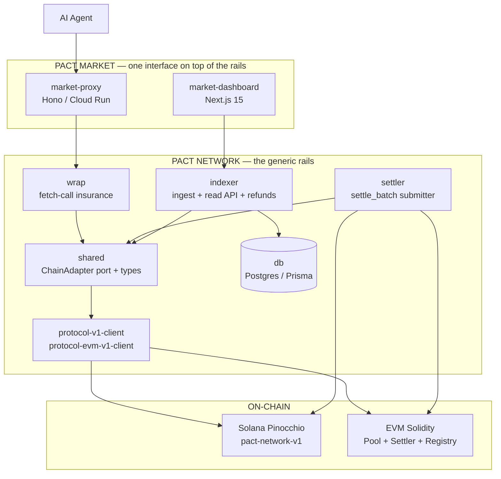
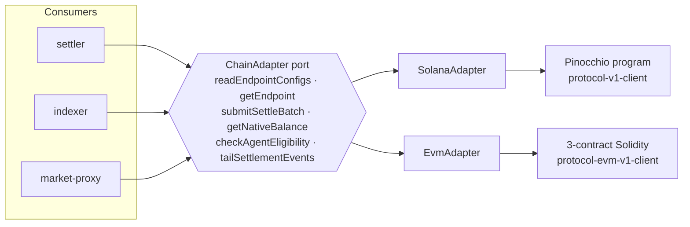
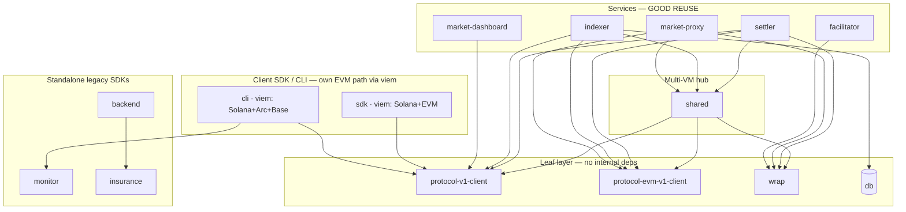
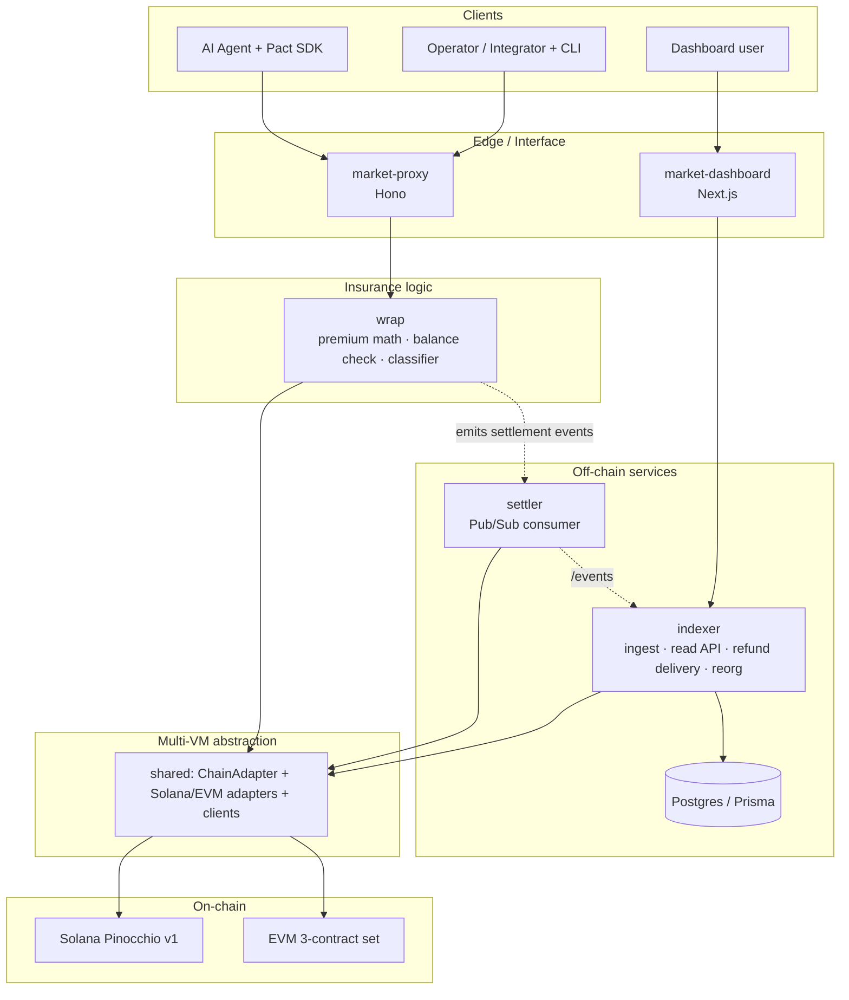
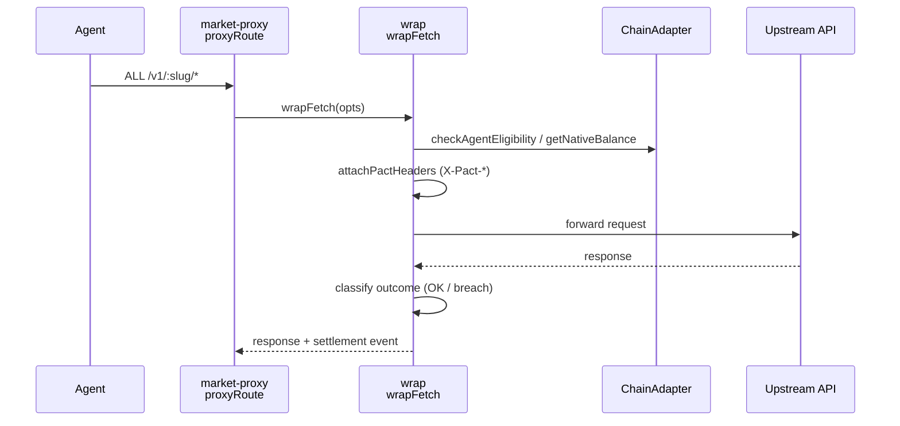
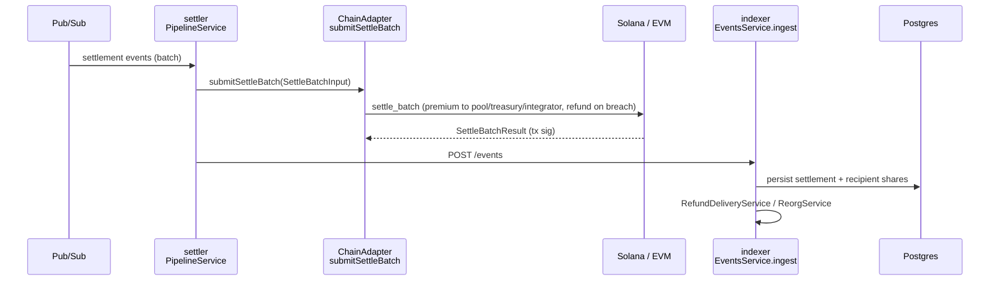
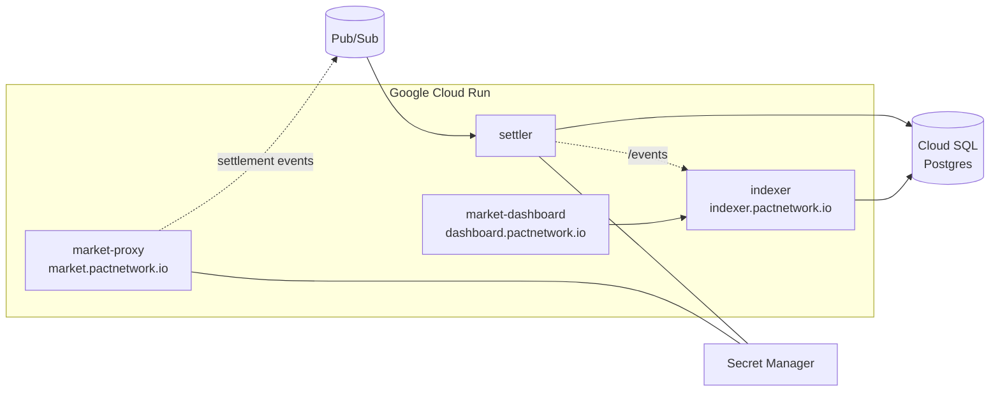

# Pact Network — Architecture Overview (EN)

> Generated 2026-06-02, updated 2026-06-03 (off-chain V2 removed) from the `feat/multi-network` branch, grounded in the GitNexus code graph (1,756 files / 16,841 symbols / 251 execution flows) and the live workspace layout. Diagrams are Mermaid (render on GitHub).

---

## 1. What this project is

**Pact Network is an on-chain risk layer for AI-agent API payments.** For each insured API endpoint the protocol holds a coverage pool, debits a small premium from the agent's stablecoin balance on every call, and automatically refunds the agent when a call breaches an SLA (latency, 5xx, network error). Every settlement is on-chain, with explicit per-recipient fee splits: most of the premium stays in the pool, a configurable cut goes to the network treasury, and another cut goes to the integrator who registered the endpoint.

The codebase separates cleanly into **two products**:

| Product | What it is | Surface |
|---------|------------|---------|
| **Pact Network** | The generic *rails* — on-chain programs (Solana + EVM), the multi-VM abstraction, wrap libraries, settler, indexer, shared types, DB schema. Anyone can build on it. | npm packages + on-chain programs |
| **Pact Market** | *One opinionated interface* on top of the rails — a hosted proxy wrapping curated providers (Helius, Birdeye, Jupiter, Elfa, fal.ai) + a dashboard. | `market.pactnetwork.io`, `dashboard.pactnetwork.io` |

---

## 2. The multi-VM seam (the heart of the current architecture)

The defining feature of the current `feat/multi-network` branch is a **ports-and-adapters (hexagonal)** design that lets the off-chain fleet speak to Solana *and* EVM chains (Arc, Base) through one interface.

- **Port:** `ChainAdapter` (`packages/shared/src/chain-adapter.ts`) — `ChainVm = "solana" | "evm"`.
- **Adapters:** `SolanaAdapter` (`packages/shared/src/adapters/solana/`) and `EvmAdapter` (`packages/shared/src/adapters/evm/`).
- **Consumers:** settler (`submitSettleBatch`), indexer (`adapters.service.ts`, `tailSettlementEvents`), market-proxy (`lib/balance.ts`, eligibility checks).

`ChainAdapter` exposes: `readEndpointConfigs` / `readEndpointConfigsFrom`, `getEndpoint`, `submitSettleBatch`, `getNativeBalance`, `checkAgentEligibility`, `tailSettlementEvents`. To add a new chain you implement one adapter — the settler/indexer/proxy code is chain-agnostic.

---

## 3. Package inventory

The monorepo is pnpm + Turborepo. 19 packages (after removing the 5 off-chain V2 packages on 2026-06-03), grouped by layer:

### On-chain programs
| Package | Role |
|---------|------|
| `program/programs-pinocchio/pact-network-v1-pinocchio` | **Solana v1** (Pinocchio): agent prepaid wallet via SPL approval, per-endpoint pools, fee recipients, pool-as-residual settlement |
| `program/programs-pinocchio/pact-network-v2-pinocchio` | Solana v2 (future): multi-underwriter parametric insurance + claims |
| `program-evm/protocol-evm-v1` | **EVM v1** (Solidity): 3-contract set — `PactPool`, `PactSettler`, `PactRegistry` |
| `program/programs/pact-insurance` | LEGACY Anchor crate — rollback fallback only, do not modify |

### Protocol clients (TS)
| Package | Role |
|---------|------|
| `protocol-v1-client` | TS client for Solana v1 (PDAs, ix builders, account decoders, error map) |
| `protocol-evm-v1-client` | TS client for EVM v1 (abi, addresses, encode, state, errors) |

### Rails — generic off-chain
| Package | Role |
|---------|------|
| `shared` | **Multi-VM abstraction** (`ChainAdapter`, adapters), shared types, PDA seed constants |
| `wrap` | Generic fetch-call insurance (`wrapFetch`, BalanceCheck, Classifier, EventSink, X-Pact-* headers) |
| `settler` | Pub/Sub → `settle_batch` submitter (NestJS) |
| `indexer` | Per-call indexer + read API + refund delivery + reorg handling (NestJS) |
| `db` | Prisma schema (pool state, settlements, recipient shares, earnings) |

### Pact Market — the interface
| Package | Role |
|---------|------|
| `market-proxy` | Hono proxy wrapping curated providers; consumes `wrap` |
| `market-dashboard` | Next.js 15 dashboard (App Router, Tailwind 4, wallet-adapter) |

### Client / SDK / tooling
| Package | Role |
|---------|------|
| `sdk` | Agent-side SDK (createPact, golden-fetch, Solana+EVM signing). *Merchant surface is in open PR #223 (`feat/merchant-sdk`), not merged into this branch.* |
| `cli` | `pact-cli` — operator + agent command line |
| `facilitator` | x402-style payment facilitator |
| `monitor` / `insurance` | Pre-Step-A SDKs (reliability monitor, legacy v2 insurance) |
| `backend` | **Live Market control-plane** (Fastify): private beta gate, self-serve API-key issuance, faucet, partners/CRM — `market-proxy`'s beta-gate validates keys issued here, so it is release-critical. Also still hosts the legacy public scorecard (providers/records/analytics) and V2 claims (`pools.ts` + cranks are the only `insurance`-coupled part). |
| `scorecard` | Legacy public-scorecard frontend (Vite/React) — calls `backend` over HTTP. |
| `dummy-upstream` | Keyless test upstream for smoke tests |

---

## 4. Package dependency & reuse

The 19 packages (after removing the 5 off-chain V2 packages on 2026-06-03) split into a **server backbone** (settler/indexer/proxy on `shared` + `wrap` + clients) and a set of **client-side / standalone packages** (the published SDK, CLI, legacy SDKs). Edges are real internal deps from each `package.json` — `dependencies` **and** `devDependencies` (bundled packages like the CLI declare workspace deps under `devDependencies` because `bun build` inlines them).

- **Server backbone:** settler/indexer/market-proxy route through `shared` + `wrap` + protocol clients. Adding a chain or service reuses this layer.
- **Client SDK/CLI are multi-network, by their own path:** `sdk` + `cli` depend on `protocol-v1-client` and use **`viem`** for EVM. The **CLI supports Solana + Arc + Base** (`lib/evm-wallet.ts`, `lib/evm-faucets.ts`, `cmd/run.ts` branch on `isEvmNetwork`); the SDK signs for Solana + EVM. They deliberately do **not** use the server-side `shared` layer (settle-submission / RPC tailing) — correct layering for a client runtime, not divergence. (CLI deps live in `devDependencies` because it is bundled via `bun build`.)
- **Standalone legacy:** `monitor` and `insurance` have 0 internal deps (pre-Step-A public SDKs).
- **Genuine duplication to watch:** the SLA status→category classifier has one true copy-paste (`backend/routes/monitor.ts:24`, a copy of `monitor`'s tree), and `wrap`'s premium/refund economics are duplicated in `facilitator/coverage.ts`. The "two V2 Solana clients" issue is now half-resolved — `protocol-v2-client` was deleted on 2026-06-03, leaving `insurance` as the sole V2 client.

> Technical-debt detail + unification plan: see **`DIVERGENCE-AUDIT.en.md`**.

---

## 5. Layered architecture

---

## 6. Core runtime flows (with real code anchors)

### Flow A — Insured API call (premium debit + classification)

Anchors: `proxyRoute` (`market-proxy/src/routes/proxy.ts:25`), `wrapFetch` (`wrap/src/wrapFetch.ts:60`), `attachPactHeaders` (`wrap/src/headers.ts:45`), balance `check` (`wrap/src/balanceCheck.ts:152`, `market-proxy/src/lib/balance.ts:63`).

### Flow B — Settlement (on-chain debit + fee split + refund)

Anchors: `PipelineService` (`settler/src/pipeline/pipeline.service.ts:8`), `SettleBatchInput` (`shared/src/chain-adapter.ts:58`), `EventsService.ingest` (`indexer/src/events/events.service.ts:70`), `RefundDeliveryService` (`indexer/src/refund-delivery/refund-delivery.service.ts:18`), `ReorgService.rollback` (`indexer/src/reorg/reorg.service.ts:143`).

---

## 7. Tech stack

| Concern | Choice |
|---------|--------|
| Language | TypeScript (off-chain), Rust/Pinocchio 0.10 (Solana), Solidity (EVM) |
| On-chain Solana | Pinocchio program, devnet `5jBQb7fL…`, mainnet `5bCJ…` |
| On-chain EVM | 3-contract Solidity (Pool/Settler/Registry) on Arc Testnet + Base Sepolia |
| Proxy | Hono on Cloud Run (Node 22) |
| Services | NestJS on Cloud Run, Pub/Sub queue, Cloud SQL Postgres |
| Dashboard | Next.js 15 (App Router), Tailwind 4, shadcn/ui, wallet-adapter |
| Solana client | `@solana/web3.js` 1.x, `@solana/kit` 2.x, hand-written decoders |
| Tooling | pnpm workspaces, Turborepo, Vitest, LiteSVM (Bun), surfpool, Foundry (EVM) |

---

## 8. Deployment topology

GCP ownership note: Secret Manager / Cloud Run / IAM are owned by Rick; on-chain ops (program deploy, authority) are split out as a separate runbook.

---

## 9. Current state (2026-06-03)

- **Off-chain V2 stack removed 2026-06-03 (commit 2b5cb0c)** — `wrap-v2`, `settler-v2`, `indexer-v2`, `db-v2`, `protocol-v2-client` source deleted (the on-chain `pact-network-v2-pinocchio` Rust program is kept).
- **Active branch:** `feat/multi-network` — multi-VM rails (Solana + Arc Testnet + Base Sepolia), CLI/SDK headers. PR #225 awaiting re-review.
- **Merchant SDK** (PR #223, branch `feat/merchant-sdk`) rebased onto this branch with tests green, but **not yet merged** — the merchant surface is not in this tree.
- **Mainnet:** Solana program `5bCJ…` live; redeploy via authority `JB7rp…` pending (unblocks SOL-01 + the FS9 `InvalidSeeds` devnet drift).
- **Known constraints:** devnet program `declare_id!` == mainnet id → `settle_batch` reverts `InvalidSeeds` on devnet until redeploy.

---

## 10. Where to look next

| Goal | Start at |
|------|----------|
| Add a new EVM chain | `shared/src/adapters/evm/`, `program-evm/protocol-evm-v1/`, endpoints catalog |
| Add a curated provider | `market-proxy/src/routes/proxy.ts`, on-chain `register-endpoint` |
| Understand settlement | `shared/src/chain-adapter.ts` → `settler/src/pipeline/` |
| Understand indexing/refunds | `indexer/src/events/events.service.ts`, `indexer/src/refund-delivery/` |
| On-chain Solana logic | `program/programs-pinocchio/pact-network-v1-pinocchio/src/` |
| On-chain EVM logic | `program-evm/protocol-evm-v1/src/` (Pool/Settler/Registry) |
