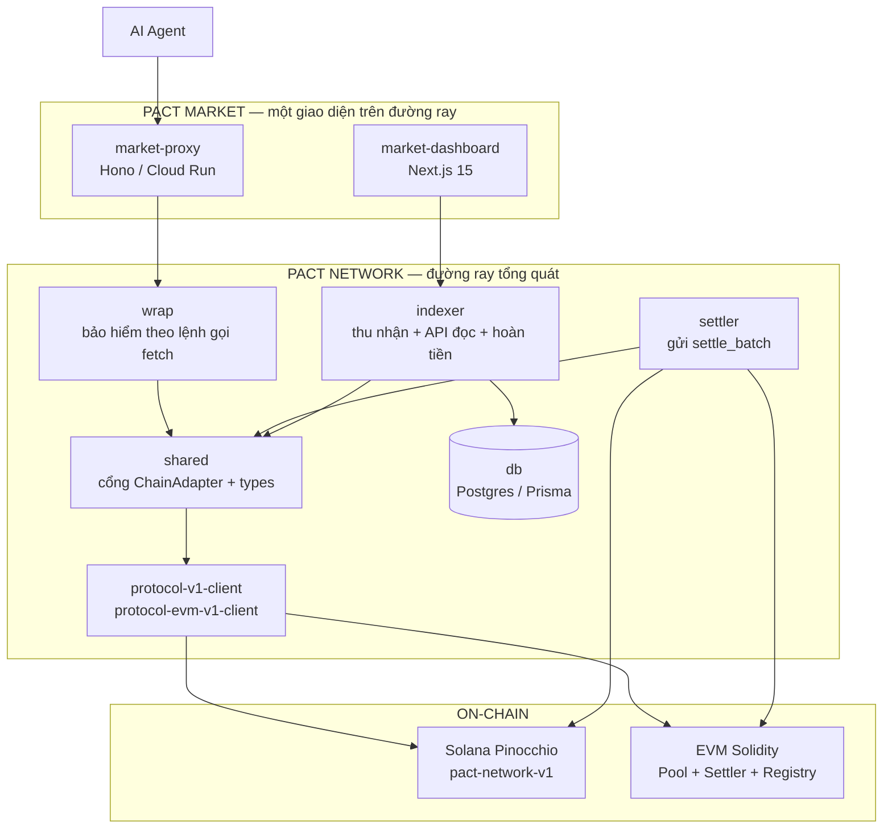
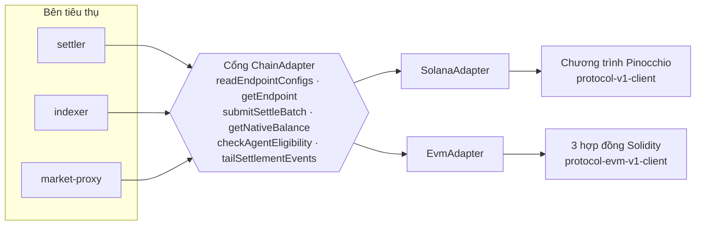
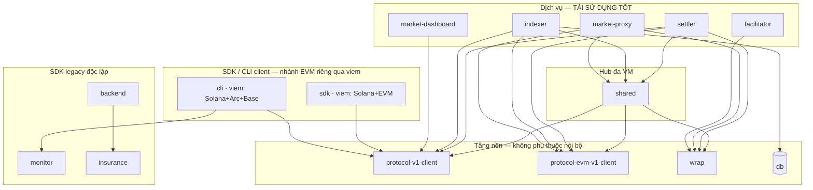
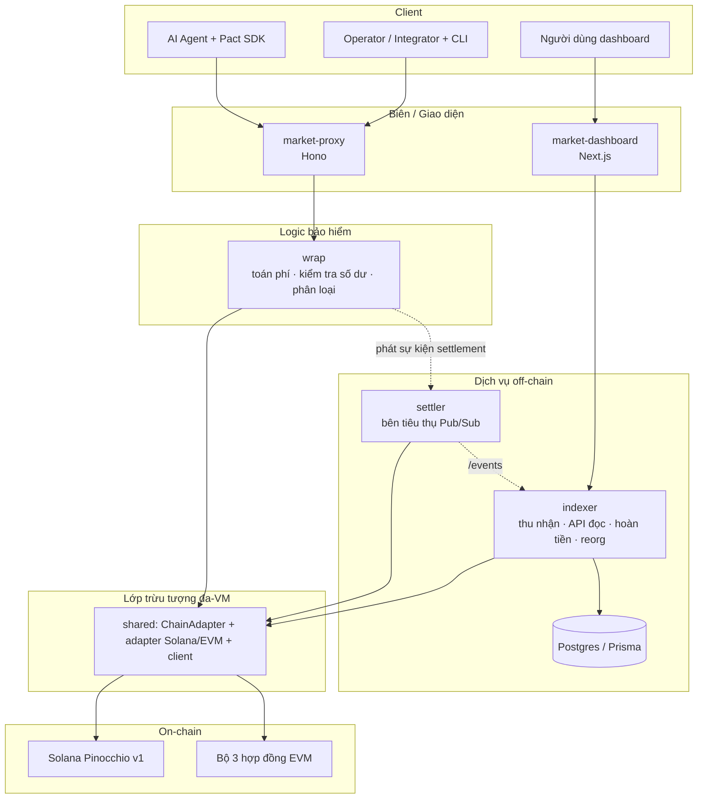
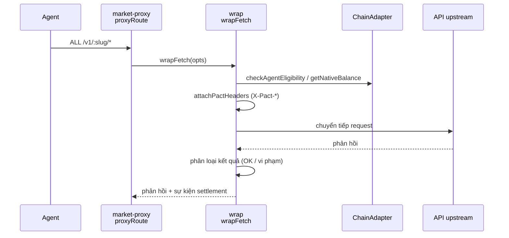
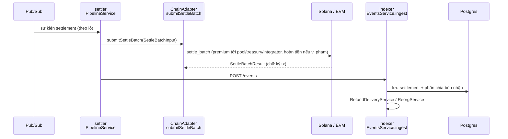
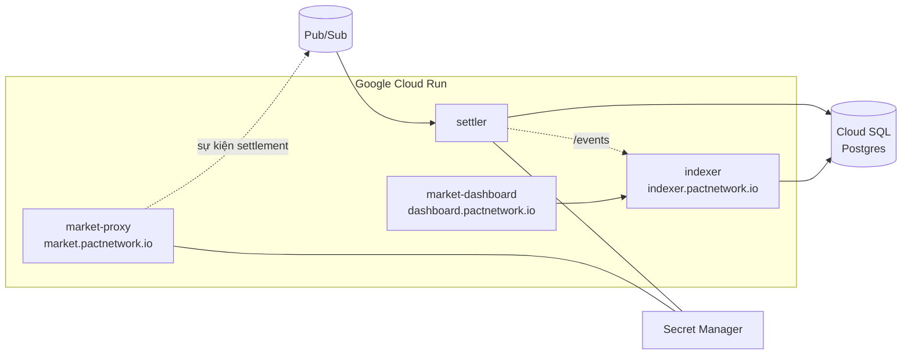

# Pact Network — Tổng quan Kiến trúc (VI)

> Tạo ngày 2026-06-02, cập nhật 2026-06-03 (đã gỡ V2 off-chain) từ nhánh `feat/multi-network`, dựa trên đồ thị mã nguồn GitNexus (1.756 file / 16.841 ký hiệu / 251 luồng thực thi) và cấu trúc workspace hiện tại. Biểu đồ dùng Mermaid (hiển thị được trên GitHub).

---

## 1. Dự án này là gì

**Pact Network là một lớp quản trị rủi ro on-chain cho việc thanh toán API của AI agent.** Với mỗi endpoint API được bảo hiểm, giao thức giữ một pool bảo hiểm (coverage pool), trừ một khoản phí (premium) nhỏ từ số dư stablecoin của agent mỗi lần gọi, và **tự động hoàn tiền** cho agent khi cuộc gọi vi phạm SLA (độ trễ, lỗi 5xx, lỗi mạng). Mọi lần thanh toán (settlement) đều diễn ra on-chain, với phần chia phí rõ ràng cho từng bên nhận: phần lớn premium ở lại pool, một phần cấu hình được vào ngân quỹ mạng (treasury), và một phần vào integrator đã đăng ký endpoint.

Mã nguồn tách biệt rõ ràng thành **hai sản phẩm**:

| Sản phẩm | Là gì | Bề mặt |
|----------|-------|--------|
| **Pact Network** | *Đường ray* tổng quát — chương trình on-chain (Solana + EVM), lớp trừu tượng đa-VM, thư viện wrap, settler, indexer, kiểu dữ liệu dùng chung, schema DB. Ai cũng có thể xây trên đó. | npm packages + chương trình on-chain |
| **Pact Market** | *Một giao diện cụ thể* xây trên đường ray — proxy được host bọc các nhà cung cấp được tuyển chọn (Helius, Birdeye, Jupiter, Elfa, fal.ai) + dashboard. | `market.pactnetwork.io`, `dashboard.pactnetwork.io` |

---

## 2. Mối nối đa-VM (trái tim của kiến trúc hiện tại)

Đặc điểm định hình nhánh `feat/multi-network` hiện tại là thiết kế **cổng-và-bộ-điều-hợp (ports-and-adapters / hexagonal)** cho phép các dịch vụ off-chain nói chuyện với Solana *và* các chain EVM (Arc, Base) qua một giao diện duy nhất.

- **Cổng (port):** `ChainAdapter` (`packages/shared/src/chain-adapter.ts`) — `ChainVm = "solana" | "evm"`.
- **Bộ điều hợp (adapter):** `SolanaAdapter` (`packages/shared/src/adapters/solana/`) và `EvmAdapter` (`packages/shared/src/adapters/evm/`).
- **Bên tiêu thụ:** settler (`submitSettleBatch`), indexer (`adapters.service.ts`, `tailSettlementEvents`), market-proxy (`lib/balance.ts`, kiểm tra điều kiện).

`ChainAdapter` cung cấp: `readEndpointConfigs` / `readEndpointConfigsFrom`, `getEndpoint`, `submitSettleBatch`, `getNativeBalance`, `checkAgentEligibility`, `tailSettlementEvents`. Để thêm một chain mới, bạn chỉ cần hiện thực một adapter — phần mã settler/indexer/proxy không phụ thuộc vào chain cụ thể.

---

## 3. Danh mục các package

Monorepo dùng pnpm + Turborepo. 19 package (sau khi gỡ 5 package V2 off-chain ngày 2026-06-03), nhóm theo tầng:

### Chương trình on-chain
| Package | Vai trò |
|---------|---------|
| `program/programs-pinocchio/pact-network-v1-pinocchio` | **Solana v1** (Pinocchio): ví trả trước của agent qua SPL approval, pool theo từng endpoint, các bên nhận phí, thanh toán theo kiểu pool-as-residual |
| `program/programs-pinocchio/pact-network-v2-pinocchio` | Solana v2 (tương lai): bảo hiểm tham số đa nhà bảo lãnh + claim |
| `program-evm/protocol-evm-v1` | **EVM v1** (Solidity): bộ 3 hợp đồng — `PactPool`, `PactSettler`, `PactRegistry` |
| `program/programs/pact-insurance` | Crate Anchor CŨ — chỉ để rollback, không được sửa |

### Client giao thức (TS)
| Package | Vai trò |
|---------|---------|
| `protocol-v1-client` | Client TS cho Solana v1 (PDA, builder lệnh, decoder tài khoản, bản đồ lỗi) |
| `protocol-evm-v1-client` | Client TS cho EVM v1 (abi, địa chỉ, encode, state, lỗi) |

### Đường ray — phần off-chain tổng quát
| Package | Vai trò |
|---------|---------|
| `shared` | **Lớp trừu tượng đa-VM** (`ChainAdapter`, các adapter), kiểu dùng chung, hằng số seed PDA |
| `wrap` | Bảo hiểm lệnh gọi fetch tổng quát (`wrapFetch`, BalanceCheck, Classifier, EventSink, header X-Pact-*) |
| `settler` | Bộ gửi `settle_batch` từ Pub/Sub (NestJS) |
| `indexer` | Indexer theo từng lệnh + API đọc + giao hoàn tiền + xử lý reorg (NestJS) |
| `db` | Schema Prisma (trạng thái pool, settlement, phần chia bên nhận, thu nhập) |

### Pact Market — giao diện
| Package | Vai trò |
|---------|---------|
| `market-proxy` | Proxy Hono bọc các nhà cung cấp tuyển chọn; dùng `wrap` |
| `market-dashboard` | Dashboard Next.js 15 (App Router, Tailwind 4, wallet-adapter) |

### Client / SDK / công cụ
| Package | Vai trò |
|---------|---------|
| `sdk` | SDK phía agent (createPact, golden-fetch, ký Solana+EVM). *Bề mặt merchant nằm ở PR #223 (`feat/merchant-sdk`) đang mở, chưa merge vào nhánh này.* |
| `cli` | `pact-cli` — dòng lệnh cho operator + agent |
| `facilitator` | Facilitator thanh toán kiểu x402 |
| `monitor` / `insurance` | SDK trước Step-A (giám sát độ tin cậy, bảo hiểm v2 cũ) |
| `backend` | **Control-plane Market sống** (Fastify): cổng private beta, cấp API key tự phục vụ, faucet, partners/CRM — beta-gate của `market-proxy` validate key do nó cấp, nên là release-critical. Đồng thời vẫn chứa scorecard công khai cũ (providers/records/analytics) và claims V2 (`pools.ts` + cranks là phần duy nhất dính `insurance`). |
| `scorecard` | Frontend scorecard công khai cũ (Vite/React) — gọi `backend` qua HTTP. |
| `dummy-upstream` | Upstream test không cần key cho smoke test |

---

## 4. Phụ thuộc package & tái sử dụng

19 package (sau khi gỡ 5 package V2 off-chain ngày 2026-06-03) chia thành **xương sống server** (settler/indexer/proxy trên `shared` + `wrap` + clients) và nhóm **package client / độc lập** (SDK, CLI công khai, SDK legacy). Các cạnh là phụ thuộc nội bộ thật từ mỗi `package.json` — gồm `dependencies` **và** `devDependencies` (package được bundle như CLI khai báo workspace dep ở `devDependencies` vì `bun build` gộp hết vào).

- **Xương sống server:** settler/indexer/market-proxy đi qua `shared` + `wrap` + protocol client. Thêm chain hay dịch vụ đều tái dùng lớp này.
- **SDK/CLI client LÀ đa-network, qua nhánh riêng:** `sdk` + `cli` phụ thuộc `protocol-v1-client` và dùng **`viem`** cho EVM. **CLI hỗ trợ Solana + Arc + Base** (`lib/evm-wallet.ts`, `lib/evm-faucets.ts`, `cmd/run.ts` rẽ `isEvmNetwork`); SDK ký cho Solana + EVM. Chúng **cố ý không** dùng lớp `shared` của server (gửi settle / tail RPC) — phân tầng đúng cho runtime client, không phải divergence. (Dep của CLI nằm ở `devDependencies` vì nó được bundle bằng `bun build`.)
- **Legacy độc lập:** `monitor` và `insurance` có 0 phụ thuộc nội bộ (SDK công khai từ trước Step-A).
- **Trùng lặp thật cần để ý:** classifier status→category chỉ có một bản copy thật (`backend/routes/monitor.ts:24`, sao từ cây của `monitor`), và phần kinh tế premium/refund của `wrap` bị lặp ở `facilitator/coverage.ts`. Vấn đề "hai client V2 Solana" nay đã giải quyết một nửa — `protocol-v2-client` đã xoá ngày 2026-06-03, chỉ còn `insurance` là client V2 duy nhất.

> Chi tiết nợ kỹ thuật + kế hoạch hợp nhất: xem **`DIVERGENCE-AUDIT.vi.md`**.

---

## 5. Kiến trúc phân tầng

---

## 6. Các luồng thực thi cốt lõi (kèm mỏ neo mã thật)

### Luồng A — Lệnh gọi API được bảo hiểm (trừ phí + phân loại)

Mỏ neo: `proxyRoute` (`market-proxy/src/routes/proxy.ts:25`), `wrapFetch` (`wrap/src/wrapFetch.ts:60`), `attachPactHeaders` (`wrap/src/headers.ts:45`), `check` số dư (`wrap/src/balanceCheck.ts:152`, `market-proxy/src/lib/balance.ts:63`).

### Luồng B — Settlement (trừ tiền on-chain + chia phí + hoàn tiền)

Mỏ neo: `PipelineService` (`settler/src/pipeline/pipeline.service.ts:8`), `SettleBatchInput` (`shared/src/chain-adapter.ts:58`), `EventsService.ingest` (`indexer/src/events/events.service.ts:70`), `RefundDeliveryService` (`indexer/src/refund-delivery/refund-delivery.service.ts:18`), `ReorgService.rollback` (`indexer/src/reorg/reorg.service.ts:143`).

---

## 7. Ngăn xếp công nghệ

| Hạng mục | Lựa chọn |
|----------|----------|
| Ngôn ngữ | TypeScript (off-chain), Rust/Pinocchio 0.10 (Solana), Solidity (EVM) |
| On-chain Solana | Chương trình Pinocchio, devnet `5jBQb7fL…`, mainnet `5bCJ…` |
| On-chain EVM | Bộ 3 hợp đồng Solidity (Pool/Settler/Registry) trên Arc Testnet + Base Sepolia |
| Proxy | Hono trên Cloud Run (Node 22) |
| Dịch vụ | NestJS trên Cloud Run, hàng đợi Pub/Sub, Cloud SQL Postgres |
| Dashboard | Next.js 15 (App Router), Tailwind 4, shadcn/ui, wallet-adapter |
| Client Solana | `@solana/web3.js` 1.x, `@solana/kit` 2.x, decoder viết tay |
| Công cụ | pnpm workspaces, Turborepo, Vitest, LiteSVM (Bun), surfpool, Foundry (EVM) |

---

## 8. Sơ đồ triển khai

Ghi chú sở hữu GCP: Secret Manager / Cloud Run / IAM do Rick quản lý; các thao tác on-chain (deploy chương trình, quyền authority) được tách thành runbook riêng.

---

## 9. Trạng thái hiện tại (2026-06-03)

- **Đã gỡ stack V2 off-chain ngày 2026-06-03 (commit 2b5cb0c)** — source `wrap-v2`, `settler-v2`, `indexer-v2`, `db-v2`, `protocol-v2-client` đã xoá (chương trình Rust on-chain `pact-network-v2-pinocchio` vẫn giữ).
- **Nhánh đang làm:** `feat/multi-network` — đường ray đa-VM (Solana + Arc Testnet + Base Sepolia), header CLI/SDK. PR #225 đang chờ review lại.
- **Merchant SDK** (PR #223, nhánh `feat/merchant-sdk`) đã rebase lên nhánh này và test xanh, nhưng **chưa merge** — bề mặt merchant chưa có trong cây mã này.
- **Mainnet:** Chương trình Solana `5bCJ…` đang chạy; chờ redeploy qua authority `JB7rp…` (mở khóa SOL-01 + lỗi lệch FS9 `InvalidSeeds` trên devnet).
- **Ràng buộc đã biết:** `declare_id!` của chương trình devnet == id mainnet → `settle_batch` revert `InvalidSeeds` trên devnet cho tới khi redeploy.

---

## 10. Nên xem tiếp ở đâu

| Mục tiêu | Bắt đầu tại |
|----------|-------------|
| Thêm chain EVM mới | `shared/src/adapters/evm/`, `program-evm/protocol-evm-v1/`, catalog endpoint |
| Thêm nhà cung cấp tuyển chọn | `market-proxy/src/routes/proxy.ts`, `register-endpoint` on-chain |
| Hiểu settlement | `shared/src/chain-adapter.ts` → `settler/src/pipeline/` |
| Hiểu indexing/hoàn tiền | `indexer/src/events/events.service.ts`, `indexer/src/refund-delivery/` |
| Logic Solana on-chain | `program/programs-pinocchio/pact-network-v1-pinocchio/src/` |
| Logic EVM on-chain | `program-evm/protocol-evm-v1/src/` (Pool/Settler/Registry) |
