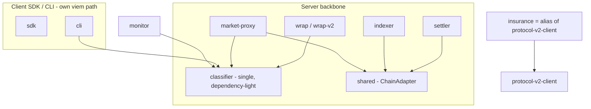

# Pact Network — Reuse & Technical-Debt Audit (EN)

> Generated 2026-06-02 from `feat/multi-network`. Based on the real dependency graph — every `package.json` (**`dependencies` + `devDependencies`**) plus actual source imports across 24 workspace packages. Companion to `ARCHITECTURE.en.md`.

---

## 1. TL;DR

- The **server backbone** (`shared` + `wrap` + protocol clients, consumed by `settler` / `indexer` / `market-proxy`) is well-factored and multi-VM. 👍
- The **published SDK and CLI are multi-network**: `cli` supports **Solana + Arc + Base**, `sdk` signs for Solana + EVM (both via `viem`). They intentionally do **not** sit on the server-side `shared` layer — correct layering for a client runtime, **not** debt.
- Real debt is narrow: **one duplicated concept (the SLA classifier)** and **two parallel V2 Solana clients**. Everything else is minor.

---

## 2. Findings (with evidence)

| # | Finding | Evidence | Severity |
|---|---------|----------|----------|
| D1 | **Classifier logic lives in 5 packages** | `wrap/src/classifier.ts`, `wrap-v2/src/classifier.ts`, `monitor/src/classifier.ts`, `cli/src/lib/pay-classifier.ts`, `market-proxy/src/lib/classifiers.ts` (+ a backend error-classification migration). **No** cross-package classifier parity test exists in source, so the copies are currently unguarded against drift. | 🟠 Medium |
| D2 | **Two parallel V2 Solana clients** | `insurance` (`client.ts` + `kit-client.ts` + `legacy-anchor-client.ts` + `generated/`) vs `protocol-v2-client` (`borsh/decoders/instructions/pda/state`). Both target the v2 program; the planned alias was never completed. Only consumer of `insurance` is `backend` — and only its V2/claims subset (`routes/pools.ts` + `crank/*` + `services/claim-settlement.ts`), not the release-critical Market control-plane. | 🟠 Medium |
| D3 | **`monitor` is a standalone island** | 0 internal deps; wraps `fetch()` for reliability with its own classifier. Overlaps `wrap` conceptually but shares nothing. *(Largely intentional — pre-Step-A public SDK.)* | 🟡 Low |
| D4 | **CLI keeps local facilitator/envelope copies** | `cli/src/lib/facilitator.ts` + `cli/src/lib/envelope.ts` reimplement what the `facilitator` package does. A client needs its own caller, but the wire **contract/types** could be shared. | 🟡 Low |

### What is NOT a problem (verified, despite first impressions)
- **CLI is fully multi-network** — `lib/evm-wallet.ts`, `lib/evm-faucets.ts` (`arc-testnet`, `base-sepolia`, `base-mainnet`, `arc-mainnet`), `cmd/run.ts` branches on `isEvmNetwork`. Uses `viem`.
- **SDK supports EVM** — `viem` dependency + EVM signing in `signer.ts`. Its `network.ts` `Network = mainnet|devnet|localnet` is only the *Solana settlement-program* config, not the SDK's whole network capability.
- **CLI declares its deps** — in `devDependencies` (`protocol-v1-client`, `monitor`, `viem`, `@solana/kit`…), which is correct because the CLI is **bundled** via `bun build` into a single `dist/pact.js` (no runtime `node_modules`). Not a phantom dependency.
- **SDK/CLI not depending on `shared` is correct layering**, not divergence: `shared` is server-side (settle-batch submission, RPC tailing, Pub/Sub); a browser/CLI SDK should keep its own lightweight client path.

### Corrected isolation map (incl. devDependencies)
```
monitor      → (none)                              # standalone legacy
insurance    → (none)                              # standalone legacy, used by backend
sdk          → protocol-v1-client            (+ viem: Solana + EVM)
cli          → protocol-v1-client, monitor   (+ viem: Solana + Arc + Base)
facilitator  → wrap
backend      → insurance
--- server backbone ---
shared       → protocol-v1-client, protocol-evm-v1-client, wrap
settler      → shared, wrap, protocol-v1-client, protocol-evm-v1-client
indexer      → shared, db, protocol-v1-client, protocol-evm-v1-client
market-proxy → shared, wrap, protocol-evm-v1-client
```

---

## 3. Unification plan (prioritized)

Only two items carry real weight. Each is a future crew task; do **not** execute inline.

### P1 — Unify the classifier  ·  🟠 highest ROI, low risk
- **Problem:** D1. Five copies of breach classification, with no shared parity guard.
- **Action:** extract one canonical classifier (new `@pact-network/classifier`, or promote `wrap/classifier.ts` as the source of truth). Re-point `wrap`, `wrap-v2`, `market-proxy`, `cli`, `monitor`, `backend` at it. Keep it dependency-light so the CLI can import it without pulling server code.
- **Guardrail:** write a shared test suite while extracting — there is no existing classifier parity test to lean on.

### P2 — Merge the two V2 Solana clients  ·  🟠 medium
- **Problem:** D2.
- **Action:** complete the planned alias — make `@q3labs/pact-insurance` re-export `@pact-network/protocol-v2-client`, or migrate the only consumer (`backend`) to `protocol-v2-client` and retire insurance's duplicate client. Keep `legacy-anchor-client.ts` only as a rollback path.
- **Guardrail:** `backend` test suite must stay green.

### P3 — Minor cleanups (optional)  ·  🟡 low
- Extract a shared facilitator **wire contract/types** so `cli/lib/facilitator.ts` consumes the `facilitator` package's types instead of duplicating them (D4).
- Once P1 lands, have `monitor` import the canonical classifier instead of its own (D3).

---

## 4. Target state (after P1–P2)



The win: one classifier imported everywhere, one V2 client. The SDK/CLI keep their (correct) independent client path — they just stop carrying a private copy of the classifier.

---

## 5. Suggested sequencing for crews
1. **P1** (classifier) — one crew, single PR, parity test as guard.
2. **P2** (v2 client merge) — separate crew, gated on `backend` tests.
3. **P3** (optional minors) — opportunistic, after P1.
