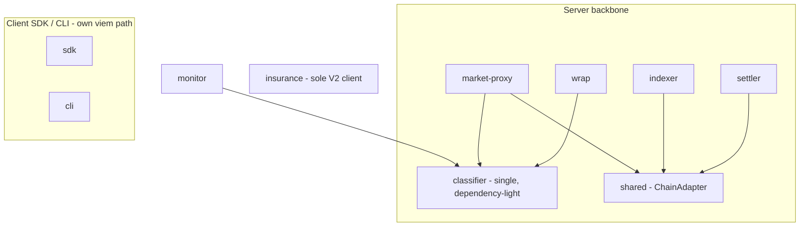

# Pact Network — Reuse & Technical-Debt Audit (EN)

> Generated 2026-06-02, updated 2026-06-03 (off-chain V2 removed) from `feat/multi-network`. Based on the real dependency graph — every `package.json` (**`dependencies` + `devDependencies`**) plus actual source imports across 19 packages (after removing the 5 off-chain V2 packages on 2026-06-03). Companion to `ARCHITECTURE.en.md`.
>
> Full per-package breakdown: `PACKAGE-BREAKDOWN.en.md` / `PACKAGE-BREAKDOWN.vi.md`; corrected classifier detail: `experiments/3-cleanup-dedupe-rails-core-extract-pact-network-classifier/ANALYSIS.md`.

---

## 1. TL;DR

- The **server backbone** (`shared` + `wrap` + protocol clients, consumed by `settler` / `indexer` / `market-proxy`) is well-factored and multi-VM. 👍
- The **published SDK and CLI are multi-network**: `cli` supports **Solana + Arc + Base**, `sdk` signs for Solana + EVM (both via `viem`). They intentionally do **not** sit on the server-side `shared` layer — correct layering for a client runtime, **not** debt.
- Real debt is narrow and now narrower: **one true classifier copy-paste** (`backend/routes/monitor.ts:24`) plus a missed **second copy of `wrap`'s premium/refund economics** (`facilitator/coverage.ts`). The **"two parallel V2 Solana clients"** finding is now **half-resolved** — `protocol-v2-client` was deleted on 2026-06-03, leaving `insurance` as the sole V2 client. Everything else is minor.

---

## 2. Findings (with evidence)

| # | Finding | Evidence | Severity |
|---|---------|----------|----------|
| D1 | **One true classifier copy-paste, not five** (was overstated) | `wrap/src/classifier.ts:52` is the **canonical rails source of truth** (the SLA `Outcome` + premium/refund). The earlier "5 packages" count was wrong: `wrap-v2/src/classifier.ts` was **deleted** in `2b5cb0c`; `market-proxy/src/lib/classifiers.ts:12` **imports** `wrap` (a consumer, not a copy); `monitor/src/classifier.ts:3` is a **separate reliability classifier** (different vocab — `timeout`/`schema_mismatch`, raw `statusCode`, no economics); `cli/src/lib/pay-classifier.ts:397` is a **subprocess stdout/stderr stream parser** (different input domain); `backend/migrations/20260503-split-error-classification.ts` is a **DB CHECK constraint**, not a runtime classifier. The **one genuine copy-paste** is `backend/src/routes/monitor.ts:24` (a near-verbatim subset of `monitor`'s tree). **Missed by the original audit:** `facilitator/src/lib/coverage.ts:114` `computeCoverage` duplicates `wrap`'s premium/refund economics (its own doc says "identical to wrap's defaultClassifier"). Still **no** cross-package parity test exists. | 🟠 Medium |
| D2 | **One remaining V2 Solana client** (was "two parallel") — half-resolved | `protocol-v2-client` was **deleted** on 2026-06-03 (`2b5cb0c`), so `insurance` (`client.ts` + `kit-client.ts` + `legacy-anchor-client.ts` + `generated/`) is now the **sole** V2 client — no longer "parallel". Only consumer is `backend`, and only its V2/claims subset (`routes/pools.ts` + `crank/*` + `services/claim-settlement.ts`), not the release-critical Market control-plane. Remaining work is cleanup/notes only — keep `legacy-anchor-client.ts` as the rollback path. | 🟠 Medium |
| D3 | **`monitor` is a standalone island** | 0 internal deps; wraps `fetch()` for reliability with its own classifier. Overlaps `wrap` conceptually but shares nothing. *(Largely intentional — pre-Step-A public SDK.)* | 🟡 Low |
| D4 | **CLI keeps local facilitator/envelope copies** | `cli/src/lib/facilitator.ts` + `cli/src/lib/envelope.ts` reimplement what the `facilitator` package does. A client needs its own caller, but the wire **contract/types** could be shared. | 🟡 Low |

### What is NOT a problem (verified, despite first impressions)
- **CLI is fully multi-network** — `lib/evm-wallet.ts`, `lib/evm-faucets.ts` (`arc-testnet`, `base-sepolia`, `base-mainnet`, `arc-mainnet`), `cmd/run.ts` branches on `isEvmNetwork`. Uses `viem`.
- **SDK supports EVM** — `viem` dependency + EVM signing in `signer.ts`. Its `network.ts` `Network = mainnet|devnet|localnet` is only the *Solana settlement-program* config, not the SDK's whole network capability.
- **CLI declares its deps** — in `devDependencies` (`protocol-v1-client`, `monitor`, `viem`, `@solana/kit`…), which is correct because the CLI is **bundled** via `bun build` into a single `dist/pact.js` (no runtime `node_modules`). Not a phantom dependency.
- **SDK/CLI not depending on `shared` is correct layering**, not divergence: `shared` is server-side (settle-batch submission, RPC tailing, Pub/Sub); a browser/CLI SDK should keep its own lightweight client path.

### Corrected isolation map (incl. devDependencies)
```
monitor      → (none)                              # standalone legacy
insurance    → (none)                              # standalone legacy, used by backend
sdk          → protocol-v1-client            (+ viem: Solana + EVM)
cli          → protocol-v1-client, monitor   (+ viem: Solana + Arc + Base)
facilitator  → wrap
backend      → insurance
--- server backbone ---
shared       → protocol-v1-client, protocol-evm-v1-client, wrap
settler      → shared, wrap, protocol-v1-client, protocol-evm-v1-client
indexer      → shared, db, protocol-v1-client, protocol-evm-v1-client
market-proxy → shared, wrap, protocol-evm-v1-client
```

---

## 3. Unification plan (prioritized)

Only two items carry real weight. Each is a future crew task; do **not** execute inline.

### P1 — Unify the classifier  ·  🟠 highest ROI, low risk
- **Problem:** D1. One true copy-paste (`backend/routes/monitor.ts:24`) + a missed economics duplicate (`facilitator/coverage.ts:114`), with no shared parity guard. `wrap` is already canonical and `market-proxy` already imports it.
- **Action (floor):** add the missing cross-package parity test against `wrap`'s `defaultClassifier` + `monitor`'s `classify`; kill the one copy-paste by having `backend/routes/monitor.ts` import `monitor`'s `classify`. `market-proxy` already consumes `wrap`; `cli`'s stream parser stays out of scope (different input domain).
- **Action (target, optional):** extract a dependency-light `@pact-network/classifier` holding the status→category core + a single enum, and re-point `wrap` + `monitor` (+ the backend copy) at it. The premium/refund economics duplicate (`facilitator/coverage.ts`) is a separate, higher-blast-radius follow-up (money path).
- **Guardrail:** the parity test is the single most valuable deliverable — there is no existing classifier parity test to lean on.

### P2 — Retire insurance's duplicate V2 client  ·  🟠 mostly done — only cleanup/notes remain
- **Problem:** D2 — now half-resolved. `protocol-v2-client` was deleted on 2026-06-03, so there is no longer a "parallel" client; `insurance` is the sole V2 client.
- **Action:** remaining work is documentation/notes only — record that `insurance` is the canonical V2 client and keep `legacy-anchor-client.ts` strictly as a rollback path. No alias/migration left to do.
- **Guardrail:** `backend` test suite must stay green.

### P3 — Minor cleanups (optional)  ·  🟡 low
- Extract a shared facilitator **wire contract/types** so `cli/lib/facilitator.ts` consumes the `facilitator` package's types instead of duplicating them (D4).
- Once P1 lands, have `monitor` import the canonical classifier instead of its own (D3).

---

## 4. Target state (after P1–P2)



The win: `wrap`'s classifier promoted to the shared core, the one backend copy-paste retired, and a single V2 client (`insurance`). The SDK/CLI keep their (correct) independent client path — the CLI's `pay-classifier` is a stream parser in a different input domain, not a copy, so it stays out of scope.

---

## 5. Suggested sequencing for crews
1. **P1** (classifier) — one crew, single PR, parity test as guard.
2. **P2** (v2 client) — mostly done after the `protocol-v2-client` deletion; only a docs/notes pass remains, gated on `backend` tests.
3. **P3** (optional minors) — opportunistic, after P1.
