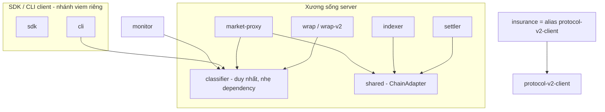

# Pact Network — Kiểm toán Tái sử dụng & Nợ kỹ thuật (VI)

> Tạo ngày 2026-06-02 từ `feat/multi-network`. Dựa trên đồ thị phụ thuộc thật — từng `package.json` (**`dependencies` + `devDependencies`**) cộng import thực tế trong source của 24 package. Đi kèm `ARCHITECTURE.vi.md`.

---

## 1. Tóm tắt nhanh

- **Xương sống server** (`shared` + `wrap` + các protocol client, dùng bởi `settler` / `indexer` / `market-proxy`) được tách lớp tốt và đa-VM. 👍
- **SDK và CLI công khai LÀ đa-network**: `cli` hỗ trợ **Solana + Arc + Base**, `sdk` ký cho cả Solana + EVM (đều qua `viem`). Chúng **cố ý không** nằm trên lớp `shared` của server — đây là phân tầng đúng cho runtime client, **không** phải nợ.
- Nợ thật rất hẹp: **một khái niệm bị nhân bản (classifier SLA)** và **hai client V2 Solana song song**. Còn lại đều nhỏ.

---

## 2. Phát hiện (kèm bằng chứng)

| # | Phát hiện | Bằng chứng | Mức độ |
|---|-----------|------------|--------|
| D1 | **Logic classifier nằm ở 5 package** | `wrap/src/classifier.ts`, `wrap-v2/src/classifier.ts`, `monitor/src/classifier.ts`, `cli/src/lib/pay-classifier.ts`, `market-proxy/src/lib/classifiers.ts` (+ một migration error-classification ở backend). **Không** có parity test classifier liên-package trong source, nên các bản sao hiện không được canh lệch. | 🟠 TB |
| D2 | **Hai client V2 Solana song song** | `insurance` (`client.ts` + `kit-client.ts` + `legacy-anchor-client.ts` + `generated/`) vs `protocol-v2-client` (`borsh/decoders/instructions/pda/state`). Cùng nhắm chương trình v2; kế hoạch alias chưa hoàn tất. Consumer duy nhất của `insurance` là `backend` — và chỉ ở nửa V2/claims (`routes/pools.ts` + `crank/*` + `services/claim-settlement.ts`), không phải control-plane Market sống. | 🟠 TB |
| D3 | **`monitor` là đảo độc lập** | 0 phụ thuộc nội bộ; tự wrap `fetch()` đo reliability với classifier riêng. Trùng khái niệm với `wrap` nhưng không share gì. *(Phần lớn là có chủ đích — SDK công khai từ trước Step-A.)* | 🟡 Thấp |
| D4 | **CLI giữ bản sao facilitator/envelope cục bộ** | `cli/src/lib/facilitator.ts` + `cli/src/lib/envelope.ts` viết lại thứ package `facilitator` đã làm. Client cần caller riêng, nhưng **contract/type** trên dây có thể share. | 🟡 Thấp |

### Cái KHÔNG phải vấn đề (đã kiểm chứng, dù thoạt nhìn dễ hiểu lầm)
- **CLI đa-network đầy đủ** — `lib/evm-wallet.ts`, `lib/evm-faucets.ts` (`arc-testnet`, `base-sepolia`, `base-mainnet`, `arc-mainnet`), `cmd/run.ts` rẽ nhánh `isEvmNetwork`. Dùng `viem`.
- **SDK có EVM** — phụ thuộc `viem` + ký EVM trong `signer.ts`. `network.ts` với `Network = mainnet|devnet|localnet` chỉ là config *chương trình settlement Solana*, không phải toàn bộ khả năng network của SDK.
- **CLI CÓ khai báo dep** — ở `devDependencies` (`protocol-v1-client`, `monitor`, `viem`, `@solana/kit`…), đúng chuẩn vì CLI được **bundle** bằng `bun build` thành một file `dist/pact.js` (không cần `node_modules` lúc chạy). Không phải phantom dependency.
- **SDK/CLI không phụ thuộc `shared` là phân tầng đúng**, không phải divergence: `shared` là tầng server (gửi settle-batch, tail RPC, Pub/Sub); SDK chạy ở browser/CLI nên giữ nhánh client gọn riêng.

### Bản đồ cô lập đã sửa (gồm cả devDependencies)
```
monitor      → (không)                             # legacy độc lập
insurance    → (không)                             # legacy độc lập, bị backend dùng
sdk          → protocol-v1-client            (+ viem: Solana + EVM)
cli          → protocol-v1-client, monitor   (+ viem: Solana + Arc + Base)
facilitator  → wrap
backend      → insurance
--- xương sống server ---
shared       → protocol-v1-client, protocol-evm-v1-client, wrap
settler      → shared, wrap, protocol-v1-client, protocol-evm-v1-client
indexer      → shared, db, protocol-v1-client, protocol-evm-v1-client
market-proxy → shared, wrap, protocol-evm-v1-client
```

---

## 3. Kế hoạch hợp nhất (theo ưu tiên)

Chỉ có hai mục thực sự quan trọng. Mỗi mục là task giao crew sau; **không** thực thi inline.

### P1 — Hợp nhất classifier  ·  🟠 ROI cao nhất, rủi ro thấp
- **Vấn đề:** D1. Năm bản sao phân loại vi phạm, không có parity guard chung.
- **Hành động:** tách một classifier chuẩn duy nhất (package mới `@pact-network/classifier`, hoặc nâng `wrap/classifier.ts` thành nguồn chân lý). Trỏ `wrap`, `wrap-v2`, `market-proxy`, `cli`, `monitor`, `backend` vào đó. Giữ nó "nhẹ dependency" để CLI import được mà không kéo theo code server.
- **Lưới an toàn:** viết một bộ test chung khi tách — hiện không có parity test classifier nào để dựa vào.

### P2 — Gộp hai client V2 Solana  ·  🟠 TB
- **Vấn đề:** D2.
- **Hành động:** hoàn tất alias đã định — cho `@q3labs/pact-insurance` re-export `@pact-network/protocol-v2-client`, hoặc migrate consumer duy nhất (`backend`) sang `protocol-v2-client` rồi gỡ client trùng trong insurance. Giữ `legacy-anchor-client.ts` chỉ để rollback.
- **Lưới an toàn:** test suite `backend` phải xanh.

### P3 — Dọn dẹp nhỏ (tùy chọn)  ·  🟡 thấp
- Tách **contract/type trên dây** của facilitator để `cli/lib/facilitator.ts` dùng type của package `facilitator` thay vì nhân bản (D4).
- Khi P1 xong, cho `monitor` import classifier chuẩn thay vì bản riêng (D3).

---

## 4. Trạng thái mục tiêu (sau P1–P2)



Lợi ích: một classifier dùng khắp nơi, một client V2. SDK/CLI giữ nhánh client độc lập (đúng) — chỉ bỏ bản classifier riêng.

---

## 5. Trình tự đề xuất giao crew
1. **P1** (classifier) — một crew, một PR, parity test làm lưới.
2. **P2** (gộp client v2) — crew riêng, gate bằng test `backend`.
3. **P3** (dọn nhỏ tùy chọn) — làm khi tiện, sau P1.
