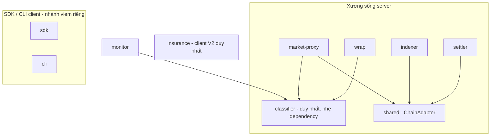

# Pact Network — Kiểm toán Tái sử dụng & Nợ kỹ thuật (VI)

> Tạo ngày 2026-06-02, cập nhật 2026-06-03 (đã gỡ V2 off-chain) từ `feat/multi-network`. Dựa trên đồ thị phụ thuộc thật — từng `package.json` (**`dependencies` + `devDependencies`**) cộng import thực tế trong source của 19 package (sau khi gỡ 5 package V2 off-chain ngày 2026-06-03). Đi kèm `ARCHITECTURE.vi.md`.
>
> Phân tích từng package đầy đủ: `PACKAGE-BREAKDOWN.en.md` / `PACKAGE-BREAKDOWN.vi.md`; chi tiết classifier đã sửa: `experiments/3-cleanup-dedupe-rails-core-extract-pact-network-classifier/ANALYSIS.md`.

---

## 1. Tóm tắt nhanh

- **Xương sống server** (`shared` + `wrap` + các protocol client, dùng bởi `settler` / `indexer` / `market-proxy`) được tách lớp tốt và đa-VM. 👍
- **SDK và CLI công khai LÀ đa-network**: `cli` hỗ trợ **Solana + Arc + Base**, `sdk` ký cho cả Solana + EVM (đều qua `viem`). Chúng **cố ý không** nằm trên lớp `shared` của server — đây là phân tầng đúng cho runtime client, **không** phải nợ.
- Nợ thật rất hẹp và nay còn hẹp hơn: **một bản copy-paste classifier thật** (`backend/routes/monitor.ts:24`) cộng một bản **lặp lại kinh tế premium/refund của `wrap`** bị bỏ sót (`facilitator/coverage.ts`). Phát hiện **"hai client V2 Solana song song"** nay đã **giải quyết một nửa** — `protocol-v2-client` đã xoá ngày 2026-06-03, chỉ còn `insurance` là client V2 duy nhất. Còn lại đều nhỏ.

---

## 2. Phát hiện (kèm bằng chứng)

| # | Phát hiện | Bằng chứng | Mức độ |
|---|-----------|------------|--------|
| D1 | **Chỉ một bản copy-paste classifier thật, không phải năm** (trước đây nói quá) | `wrap/src/classifier.ts:52` là **nguồn chân lý chuẩn của rails** (`Outcome` SLA + premium/refund). Con số "5 package" trước đây sai: `wrap-v2/src/classifier.ts` đã **xoá** ở `2b5cb0c`; `market-proxy/src/lib/classifiers.ts:12` **import** `wrap` (consumer, không phải copy); `monitor/src/classifier.ts:3` là **classifier reliability riêng** (từ vựng khác — `timeout`/`schema_mismatch`, `statusCode` thô, không có kinh tế); `cli/src/lib/pay-classifier.ts:397` là **parser stdout/stderr subprocess** (miền đầu vào khác); `backend/migrations/20260503-split-error-classification.ts` là **ràng buộc DB CHECK**, không phải classifier runtime. **Bản copy-paste thật duy nhất** là `backend/src/routes/monitor.ts:24` (sao gần nguyên xi cây của `monitor`). **Audit cũ bỏ sót:** `facilitator/src/lib/coverage.ts:114` `computeCoverage` lặp lại kinh tế premium/refund của `wrap` (doc của nó tự ghi "identical to wrap's defaultClassifier"). Vẫn **chưa** có parity test liên-package. | 🟠 TB |
| D2 | **Chỉ còn một client V2 Solana** (trước là "hai song song") — đã xong một nửa | `protocol-v2-client` đã **xoá** ngày 2026-06-03 (`2b5cb0c`), nên `insurance` (`client.ts` + `kit-client.ts` + `legacy-anchor-client.ts` + `generated/`) nay là client V2 **duy nhất** — không còn "song song". Consumer duy nhất là `backend`, và chỉ ở nửa V2/claims (`routes/pools.ts` + `crank/*` + `services/claim-settlement.ts`), không phải control-plane Market sống. Việc còn lại chỉ là dọn dẹp/ghi chú — giữ `legacy-anchor-client.ts` làm đường rollback. | 🟠 TB |
| D3 | **`monitor` là đảo độc lập** | 0 phụ thuộc nội bộ; tự wrap `fetch()` đo reliability với classifier riêng. Trùng khái niệm với `wrap` nhưng không share gì. *(Phần lớn là có chủ đích — SDK công khai từ trước Step-A.)* | 🟡 Thấp |
| D4 | **CLI giữ bản sao facilitator/envelope cục bộ** | `cli/src/lib/facilitator.ts` + `cli/src/lib/envelope.ts` viết lại thứ package `facilitator` đã làm. Client cần caller riêng, nhưng **contract/type** trên dây có thể share. | 🟡 Thấp |

### Cái KHÔNG phải vấn đề (đã kiểm chứng, dù thoạt nhìn dễ hiểu lầm)
- **CLI đa-network đầy đủ** — `lib/evm-wallet.ts`, `lib/evm-faucets.ts` (`arc-testnet`, `base-sepolia`, `base-mainnet`, `arc-mainnet`), `cmd/run.ts` rẽ nhánh `isEvmNetwork`. Dùng `viem`.
- **SDK có EVM** — phụ thuộc `viem` + ký EVM trong `signer.ts`. `network.ts` với `Network = mainnet|devnet|localnet` chỉ là config *chương trình settlement Solana*, không phải toàn bộ khả năng network của SDK.
- **CLI CÓ khai báo dep** — ở `devDependencies` (`protocol-v1-client`, `monitor`, `viem`, `@solana/kit`…), đúng chuẩn vì CLI được **bundle** bằng `bun build` thành một file `dist/pact.js` (không cần `node_modules` lúc chạy). Không phải phantom dependency.
- **SDK/CLI không phụ thuộc `shared` là phân tầng đúng**, không phải divergence: `shared` là tầng server (gửi settle-batch, tail RPC, Pub/Sub); SDK chạy ở browser/CLI nên giữ nhánh client gọn riêng.

### Bản đồ cô lập đã sửa (gồm cả devDependencies)
```
monitor      → (không)                             # legacy độc lập
insurance    → (không)                             # legacy độc lập, bị backend dùng
sdk          → protocol-v1-client            (+ viem: Solana + EVM)
cli          → protocol-v1-client, monitor   (+ viem: Solana + Arc + Base)
facilitator  → wrap
backend      → insurance
--- xương sống server ---
shared       → protocol-v1-client, protocol-evm-v1-client, wrap
settler      → shared, wrap, protocol-v1-client, protocol-evm-v1-client
indexer      → shared, db, protocol-v1-client, protocol-evm-v1-client
market-proxy → shared, wrap, protocol-evm-v1-client
```

---

## 3. Kế hoạch hợp nhất (theo ưu tiên)

Chỉ có hai mục thực sự quan trọng. Mỗi mục là task giao crew sau; **không** thực thi inline.

### P1 — Hợp nhất classifier  ·  🟠 ROI cao nhất, rủi ro thấp
- **Vấn đề:** D1. Một bản copy-paste thật (`backend/routes/monitor.ts:24`) + một bản lặp kinh tế bị bỏ sót (`facilitator/coverage.ts:114`), không có parity guard chung. `wrap` vốn đã là chuẩn và `market-proxy` đã import sẵn.
- **Hành động (sàn):** viết parity test liên-package đối chiếu `defaultClassifier` của `wrap` + `classify` của `monitor`; gỡ bản copy-paste duy nhất bằng cách cho `backend/routes/monitor.ts` import `classify` của `monitor`. `market-proxy` đã dùng `wrap`; parser stream của `cli` để ngoài phạm vi (miền đầu vào khác).
- **Hành động (mục tiêu, tùy chọn):** tách package `@pact-network/classifier` nhẹ dependency giữ lõi status→category + một enum duy nhất, rồi trỏ `wrap` + `monitor` (+ bản copy ở backend) vào đó. Bản lặp kinh tế premium/refund (`facilitator/coverage.ts`) là follow-up riêng, blast-radius cao hơn (đụng đường tiền).
- **Lưới an toàn:** parity test là deliverable giá trị nhất — hiện không có parity test classifier nào để dựa vào.

### P2 — Gỡ client V2 trùng trong insurance  ·  🟠 phần lớn đã xong — chỉ còn dọn dẹp/ghi chú
- **Vấn đề:** D2 — nay đã xong một nửa. `protocol-v2-client` đã xoá ngày 2026-06-03, nên không còn client "song song"; `insurance` là client V2 duy nhất.
- **Hành động:** việc còn lại chỉ là tài liệu/ghi chú — ghi nhận `insurance` là client V2 chuẩn và giữ `legacy-anchor-client.ts` chỉ làm đường rollback. Không còn alias/migrate nào phải làm.
- **Lưới an toàn:** test suite `backend` phải xanh.

### P3 — Dọn dẹp nhỏ (tùy chọn)  ·  🟡 thấp
- Tách **contract/type trên dây** của facilitator để `cli/lib/facilitator.ts` dùng type của package `facilitator` thay vì nhân bản (D4).
- Khi P1 xong, cho `monitor` import classifier chuẩn thay vì bản riêng (D3).

---

## 4. Trạng thái mục tiêu (sau P1–P2)



Lợi ích: classifier của `wrap` được nâng thành lõi chung, bản copy-paste duy nhất ở backend bị gỡ, và một client V2 (`insurance`). SDK/CLI giữ nhánh client độc lập (đúng) — `pay-classifier` của CLI là parser stream ở miền đầu vào khác, không phải bản copy, nên để ngoài phạm vi.

---

## 5. Trình tự đề xuất giao crew
1. **P1** (classifier) — một crew, một PR, parity test làm lưới.
2. **P2** (client v2) — phần lớn đã xong sau khi xoá `protocol-v2-client`; chỉ còn pass tài liệu/ghi chú, gate bằng test `backend`.
3. **P3** (dọn nhỏ tùy chọn) — làm khi tiện, sau P1.
